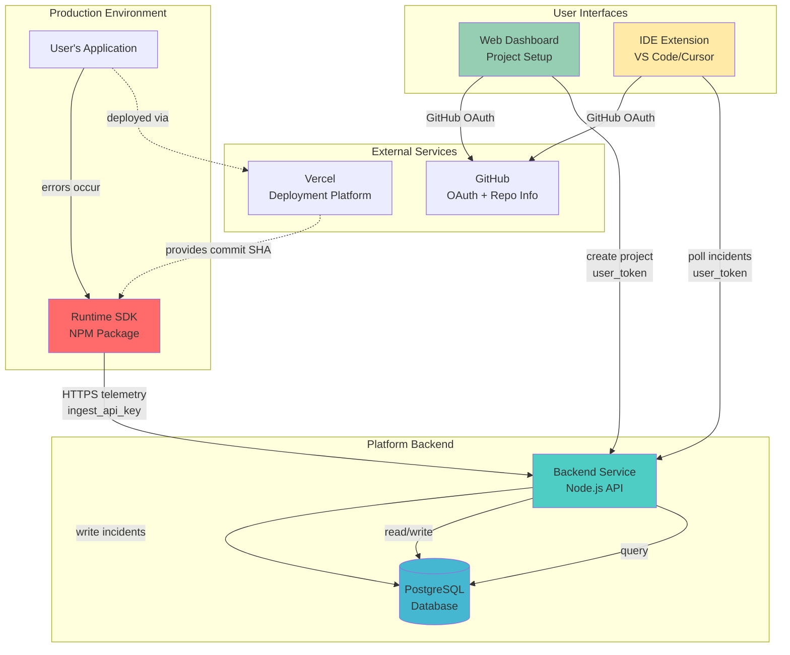
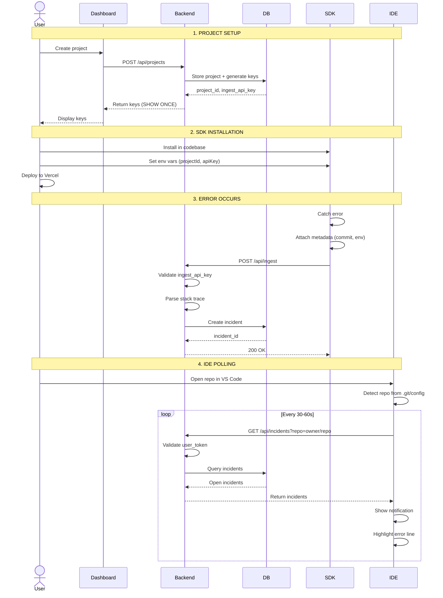

# System Architecture Design

## Overview

This is a **production-grade developer tooling platform** that helps engineers understand WHY production failures happened and WHERE they originated in code.

**NOT** a simple VS Code extension. This is **developer infrastructure** with strict separation of concerns.

---

## System Components



---

## Component Details

### 1. Runtime SDK (NPM Package)
**Location:** User's production application  
**Language:** TypeScript/JavaScript  
**Purpose:** Capture errors and send telemetry

**Key Characteristics:**
- Runs in production (must be bulletproof)
- Fails silently if misconfigured
- Never crashes the host application
- No dependencies on IDE or dashboard

### 2. Backend Service
**Location:** Platform infrastructure  
**Language:** Node.js (TypeScript)  
**Purpose:** Correlation engine and API gateway

**Key Characteristics:**
- Stateless (all state in DB)
- Validates all inputs
- Enforces authentication/authorization
- Rate limiting per project/user

### 3. Database
**Technology:** PostgreSQL  
**Purpose:** Single source of truth

**Key Characteristics:**
- Explicit relationships (no inference)
- Indexed for query performance
- Audit trail for all operations

### 4. Web Dashboard
**Location:** Hosted web app  
**Framework:** Next.js / React  
**Purpose:** Project setup and management

**Key Characteristics:**
- Thin UI (not a monitoring dashboard)
- GitHub OAuth login
- Shows API keys ONCE
- Minimal visibility into incidents

### 5. IDE Extension
**Location:** User's local machine  
**Platform:** VS Code / Cursor  
**Purpose:** Surface incidents in editor

**Key Characteristics:**
- Read-only (never writes to production)
- No API keys stored
- Polls backend every 30-60s
- Detects repo from `.git/config`

---

## Data Flow

### End-to-End Flow



---

## Security Architecture

### Authentication Flows

#### Dashboard + IDE Extension (User Auth)
```
1. User clicks "Login with GitHub"
2. Redirect to GitHub OAuth
3. GitHub returns authorization code
4. Exchange code for access token
5. Fetch user profile from GitHub
6. Create/update user in DB
7. Issue JWT token (1hr TTL)
8. Store token in HTTP-only cookie (dashboard) or secure storage (IDE)
```

#### SDK (Ingest Auth)
```
1. SDK sends request with Authorization: Bearer <ingest_api_key>
2. Backend validates key against projects.ingest_api_key
3. If valid, extract project_id
4. Process telemetry
```

### Authorization Model

| Endpoint | Auth Method | Authorization Check |
|----------|-------------|---------------------|
| `POST /api/ingest` | Ingest API Key | Key valid + not revoked |
| `GET /api/incidents` | User JWT | User owns project for repo |
| `POST /api/projects` | User JWT | User authenticated |
| `PATCH /api/incidents/:id` | User JWT | User owns project |

### Data Isolation

**Principle:** Users can ONLY access data for projects they own.

```sql
-- Example query with authorization
SELECT * FROM incidents
WHERE project_id IN (
  SELECT id FROM projects WHERE owner_id = :current_user_id
)
AND status = 'open';
```

---

## Failure Modes & Edge Cases

### SDK Failures

| Scenario | Behavior |
|----------|----------|
| Missing API key | Log warning, disable telemetry, continue app |
| Invalid API key | Log warning, disable telemetry, continue app |
| Network error | Queue events, retry with exponential backoff |
| Backend returns 429 | Drop events (prevent retry storm) |
| Backend returns 5xx | Retry up to 3 times, then drop |

**Critical:** SDK NEVER crashes the host application.

### Backend Failures

| Scenario | Behavior |
|----------|----------|
| DB connection lost | Return 503, retry connection |
| Invalid ingest payload | Return 400, log error |
| Stack trace parsing fails | Store raw stack, set file_path=null |
| Duplicate incident | Create new (no deduplication in MVP) |

### IDE Extension Failures

| Scenario | Behavior |
|----------|----------|
| Not logged in | Show "Login" prompt |
| Repo not mapped to project | Show "No project found" |
| Network error | Retry next poll cycle |
| Backend returns 401 | Prompt re-authentication |
| File not found locally | Show incident, disable "jump to line" |

---

## Scalability Considerations

### MVP Constraints
- Single Postgres instance
- Polling (no WebSockets)
- One repo per project
- Vercel only

### Future Scaling

#### Database
- Read replicas for IDE queries
- Partition `incidents` by `occurred_at` (time-series)
- Archive old incidents to cold storage

#### Backend
- Horizontal scaling (stateless API)
- Redis for rate limiting
- Message queue for ingest (decouple ingestion from processing)

#### IDE Extension
- WebSocket for real-time updates
- Local caching of incidents (reduce polling)

---

## Deployment Architecture

### Backend Service
```
Platform: Vercel / Railway / Fly.io
Runtime: Node.js 20.x
Instances: 2+ (for redundancy)
Auto-scaling: Based on CPU/memory
Health checks: /health endpoint
```

### Database
```
Platform: Supabase / Neon / AWS RDS
Version: PostgreSQL 15+
Backups: Daily automated
Connection pooling: PgBouncer
```

### Dashboard
```
Platform: Vercel
Framework: Next.js
Deployment: Git-based (main branch)
CDN: Vercel Edge Network
```

### SDK
```
Distribution: NPM registry
Versioning: Semantic versioning
Bundle size: <10KB gzipped
Dependencies: Minimal (zero if possible)
```

---

## Monitoring & Observability

### Key Metrics

#### SDK
- Telemetry send success rate
- Network error rate
- Queue depth (buffered events)

#### Backend
- Ingest throughput (events/sec)
- API latency (P50, P95, P99)
- Error rate (5xx responses)
- DB query latency

#### IDE Extension
- Poll frequency
- Incident display latency
- Authentication failures

### Alerting

| Alert | Threshold | Action |
|-------|-----------|--------|
| Ingest error rate >5% | 5 min | Page on-call |
| DB connection failures | 1 min | Auto-restart + page |
| API latency P95 >500ms | 10 min | Investigate |
| Disk usage >80% | 1 hour | Scale storage |

---

## Development Workflow

### Local Development
```bash
# Backend
cd backend
npm install
npm run dev  # Starts on localhost:3000

# Dashboard
cd dashboard
npm install
npm run dev  # Starts on localhost:3001

# SDK (testing)
cd sdk
npm install
npm run build
npm link  # Link for local testing

# IDE Extension
cd ide-extension
npm install
npm run watch  # Compile + watch
# Press F5 in VS Code to launch Extension Development Host
```

### Testing Strategy

#### SDK
- Unit tests (error capture, metadata attachment)
- Integration tests (mock backend)
- Load tests (high error volume)

#### Backend
- Unit tests (API handlers, DB queries)
- Integration tests (full API flows)
- E2E tests (SDK → Backend → DB)

#### IDE Extension
- Unit tests (repo detection, polling logic)
- Integration tests (mock backend API)
- Manual testing (real VS Code environment)

---

## Open Questions & Future Enhancements

### MVP Scope (Intentionally Excluded)
- ❌ Full distributed tracing
- ❌ Log aggregation
- ❌ Performance monitoring
- ❌ Multi-repo projects
- ❌ Team collaboration features
- ❌ Incident deduplication
- ❌ Auto-fixing code
- ❌ AI-powered root cause analysis

### Post-MVP Enhancements
- ✅ WebSocket for real-time updates
- ✅ Incident fingerprinting (deduplication)
- ✅ Multi-platform support (AWS Lambda, Cloudflare Workers)
- ✅ Team access control
- ✅ Slack/Discord notifications
- ✅ Source map support (for minified code)
- ✅ Breadcrumbs (user actions before error)

---

## Compliance & Privacy

### Data Retention
- Incidents: 90 days (configurable per project)
- Audit logs: 1 year
- User data: Until account deletion

### PII Handling
- No user PII in error messages (SDK should sanitize)
- Stack traces may contain file paths (acceptable)
- No environment variables logged

### GDPR Compliance
- User data export API
- Account deletion (hard delete)
- Data processing agreement (for EU users)
