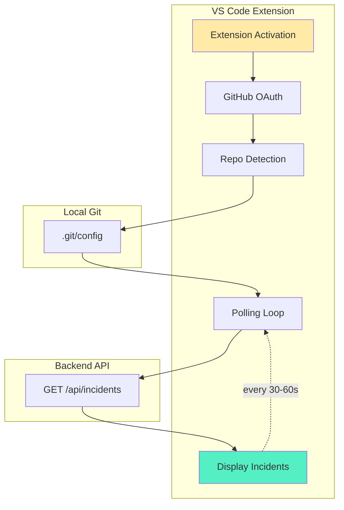

# IDE Extension Design

## Overview

The IDE Extension surfaces production incidents directly inside VS Code/Cursor. It is **read-only** and **never accesses production**.

**Key Constraint:** No API keys or project IDs stored in the extension.

---

## Architecture



---

## Extension Lifecycle

### 1. Activation

```typescript
export function activate(context: vscode.ExtensionContext) {
  // Register commands
  context.subscriptions.push(
    vscode.commands.registerCommand('rootly.login', loginCommand),
    vscode.commands.registerCommand('rootly.logout', logoutCommand),
    vscode.commands.registerCommand('rootly.refresh', refreshCommand)
  );

  // Initialize extension
  const extension = new RootlyExtension(context);
  extension.start();
}
```

### 2. Authentication

```typescript
async function loginCommand() {
  // Open GitHub OAuth in browser
  const authUrl = 'https://api.rootly.dev/auth/github/authorize';
  vscode.env.openExternal(vscode.Uri.parse(authUrl));

  // Start local server to receive callback
  const server = await startCallbackServer();
  
  // Wait for OAuth callback
  const { code } = await server.waitForCallback();

  // Exchange code for token
  const response = await fetch('https://api.rootly.dev/api/auth/github/callback', {
    method: 'POST',
    body: JSON.stringify({ code }),
  });

  const { token } = await response.json();

  // Store token securely
  await context.secrets.store('rootly.token', token);

  vscode.window.showInformationMessage('Logged in to Rootly');
}
```

**Security:**
- Token stored in VS Code's `SecretStorage` (encrypted)
- Never stored in plaintext
- Never logged or exposed

### 3. Repo Detection

```typescript
async function detectRepo(): Promise<string | null> {
  // Get workspace root
  const workspaceRoot = vscode.workspace.workspaceFolders?.[0]?.uri.fsPath;
  if (!workspaceRoot) return null;

  // Read .git/config
  const gitConfigPath = path.join(workspaceRoot, '.git', 'config');
  const gitConfig = await fs.readFile(gitConfigPath, 'utf-8');

  // Parse remote origin
  const match = gitConfig.match(/\[remote "origin"\]\s+url = (.+)/);
  if (!match) return null;

  const remoteUrl = match[1];

  // Extract owner/repo from URL
  // Examples:
  // - https://github.com/arin/checkout-api.git
  // - git@github.com:arin/checkout-api.git
  const repoMatch = remoteUrl.match(/github\.com[:/]([^/]+)\/(.+?)(\.git)?$/);
  if (!repoMatch) return null;

  const [, owner, repo] = repoMatch;
  return `${owner}/${repo}`;
}
```

**Edge Cases:**
- No `.git` folder → Show "Not a Git repo"
- Multiple remotes → Use `origin` by default
- Non-GitHub remote → Show "Only GitHub repos supported"
- Detached HEAD → Still works (uses remote URL)

---

## Polling Logic

### Polling Loop

```typescript
class IncidentPoller {
  private interval: NodeJS.Timeout | null = null;
  private pollFrequency = 30_000; // 30 seconds

  start() {
    // Initial poll
    this.poll();

    // Start interval
    this.interval = setInterval(() => this.poll(), this.pollFrequency);
  }

  stop() {
    if (this.interval) {
      clearInterval(this.interval);
      this.interval = null;
    }
  }

  async poll() {
    try {
      const repo = await detectRepo();
      if (!repo) return;

      const token = await context.secrets.get('rootly.token');
      if (!token) return;

      const incidents = await fetchIncidents(repo, token);
      
      // Update UI
      this.updateIncidentView(incidents);

      // Show notifications for new incidents
      this.notifyNewIncidents(incidents);
    } catch (error) {
      // Log error but don't crash
      console.error('[Rootly] Poll failed:', error);
    }
  }
}
```

### API Request

```typescript
async function fetchIncidents(
  repo: string,
  token: string
): Promise<Incident[]> {
  const response = await fetch(
    `https://api.rootly.dev/api/incidents?repo=${encodeURIComponent(repo)}&status=open`,
    {
      headers: {
        'Authorization': `Bearer ${token}`,
      },
    }
  );

  if (!response.ok) {
    if (response.status === 401) {
      // Token expired - prompt re-login
      vscode.window.showWarningMessage('Rootly session expired. Please log in again.');
      return [];
    }
    throw new Error(`HTTP ${response.status}`);
  }

  const { incidents } = await response.json();
  return incidents;
}
```

---

## UI Components

### 1. Sidebar View

```typescript
class IncidentTreeProvider implements vscode.TreeDataProvider<IncidentItem> {
  private incidents: Incident[] = [];
  private _onDidChangeTreeData = new vscode.EventEmitter<void>();
  readonly onDidChangeTreeData = this._onDidChangeTreeData.event;

  refresh(incidents: Incident[]) {
    this.incidents = incidents;
    this._onDidChangeTreeData.fire();
  }

  getTreeItem(element: IncidentItem): vscode.TreeItem {
    return element;
  }

  getChildren(): IncidentItem[] {
    if (this.incidents.length === 0) {
      return [new IncidentItem('No open incidents', '', 0)];
    }

    return this.incidents.map(inc => new IncidentItem(
      inc.error_message,
      inc.file_path,
      inc.line_number,
      inc.id
    ));
  }
}

class IncidentItem extends vscode.TreeItem {
  constructor(
    public readonly label: string,
    public readonly filePath: string,
    public readonly line: number,
    public readonly incidentId?: string
  ) {
    super(label, vscode.TreeItemCollapsibleState.None);

    this.tooltip = `${filePath}:${line}`;
    this.description = `${filePath}:${line}`;

    // Click to jump to file
    this.command = {
      command: 'rootly.openIncident',
      title: 'Open Incident',
      arguments: [this],
    };
  }
}
```

### 2. Inline Decorations

```typescript
class IncidentDecorator {
  private decorationType = vscode.window.createTextEditorDecorationType({
    backgroundColor: 'rgba(255, 0, 0, 0.1)',
    borderLeft: '3px solid red',
    isWholeLine: true,
  });

  update(editor: vscode.TextEditor, incidents: Incident[]) {
    const filePath = vscode.workspace.asRelativePath(editor.document.uri);

    // Find incidents for this file
    const fileIncidents = incidents.filter(inc => inc.file_path === filePath);

    // Create decorations
    const decorations = fileIncidents.map(inc => ({
      range: new vscode.Range(inc.line_number - 1, 0, inc.line_number - 1, 0),
      hoverMessage: `**Production Error**\n\n${inc.error_message}\n\nCommit: ${inc.commit_sha.slice(0, 7)}`,
    }));

    editor.setDecorations(this.decorationType, decorations);
  }
}
```

### 3. Notifications

```typescript
function notifyNewIncidents(incidents: Incident[]) {
  const newIncidents = incidents.filter(inc => !seenIncidents.has(inc.id));

  if (newIncidents.length === 0) return;

  // Mark as seen
  newIncidents.forEach(inc => seenIncidents.add(inc.id));

  // Show notification
  const message = newIncidents.length === 1
    ? `New production error: ${newIncidents[0].error_message}`
    : `${newIncidents.length} new production errors`;

  vscode.window.showErrorMessage(message, 'View').then(action => {
    if (action === 'View') {
      vscode.commands.executeCommand('rootly.showSidebar');
    }
  });
}
```

---

## Commands

### `rootly.openIncident`

```typescript
async function openIncidentCommand(item: IncidentItem) {
  // Find file in workspace
  const workspaceRoot = vscode.workspace.workspaceFolders?.[0]?.uri.fsPath;
  if (!workspaceRoot) return;

  const filePath = path.join(workspaceRoot, item.filePath);

  // Check if file exists
  if (!fs.existsSync(filePath)) {
    vscode.window.showWarningMessage(
      `File not found: ${item.filePath}. You may be on a different commit.`
    );
    return;
  }

  // Open file
  const document = await vscode.workspace.openTextDocument(filePath);
  const editor = await vscode.window.showTextDocument(document);

  // Jump to line
  const position = new vscode.Position(item.line - 1, 0);
  editor.selection = new vscode.Selection(position, position);
  editor.revealRange(new vscode.Range(position, position), vscode.TextEditorRevealType.InCenter);
}
```

### `rootly.resolveIncident`

```typescript
async function resolveIncidentCommand(incidentId: string) {
  const token = await context.secrets.get('rootly.token');
  if (!token) return;

  await fetch(`https://api.rootly.dev/api/incidents/${incidentId}`, {
    method: 'PATCH',
    headers: {
      'Authorization': `Bearer ${token}`,
      'Content-Type': 'application/json',
    },
    body: JSON.stringify({ status: 'resolved' }),
  });

  vscode.window.showInformationMessage('Incident marked as resolved');

  // Refresh incidents
  vscode.commands.executeCommand('rootly.refresh');
}
```

---

## State Management

### Extension State

```typescript
interface ExtensionState {
  token: string | null;
  repo: string | null;
  incidents: Incident[];
  lastPoll: number;
  seenIncidents: Set<string>;
}

class StateManager {
  private state: ExtensionState = {
    token: null,
    repo: null,
    incidents: [],
    lastPoll: 0,
    seenIncidents: new Set(),
  };

  async load(context: vscode.ExtensionContext) {
    // Load token from secure storage
    this.state.token = await context.secrets.get('rootly.token') || null;

    // Load seen incidents from workspace state
    const seen = context.workspaceState.get<string[]>('seenIncidents', []);
    this.state.seenIncidents = new Set(seen);
  }

  async save(context: vscode.ExtensionContext) {
    // Save seen incidents
    await context.workspaceState.update(
      'seenIncidents',
      Array.from(this.state.seenIncidents)
    );
  }
}
```

---

## Error Handling

### Network Errors

```typescript
async function poll() {
  try {
    const incidents = await fetchIncidents(repo, token);
    this.updateIncidentView(incidents);
  } catch (error) {
    if (error.code === 'ENOTFOUND' || error.code === 'ETIMEDOUT') {
      // Network error - retry next cycle
      console.error('[Rootly] Network error, will retry');
      return;
    }

    if (error.status === 401) {
      // Unauthorized - prompt re-login
      vscode.window.showWarningMessage('Rootly session expired. Please log in again.');
      return;
    }

    // Unknown error - log and continue
    console.error('[Rootly] Poll failed:', error);
  }
}
```

### File Not Found

```typescript
async function openIncident(item: IncidentItem) {
  if (!fs.existsSync(filePath)) {
    const action = await vscode.window.showWarningMessage(
      `File not found: ${item.filePath}. You may be on a different commit.`,
      'View Commit'
    );

    if (action === 'View Commit') {
      // Open GitHub commit URL
      const commitUrl = `https://github.com/${repo}/commit/${item.commitSha}`;
      vscode.env.openExternal(vscode.Uri.parse(commitUrl));
    }
    return;
  }

  // ... open file
}
```

---

## Performance

### Polling Optimization

```typescript
class AdaptivePoller {
  private baseFrequency = 30_000; // 30 seconds
  private maxFrequency = 300_000; // 5 minutes
  private currentFrequency = this.baseFrequency;

  async poll() {
    const incidents = await fetchIncidents(repo, token);

    if (incidents.length > 0) {
      // Active incidents - poll frequently
      this.currentFrequency = this.baseFrequency;
    } else {
      // No incidents - slow down polling
      this.currentFrequency = Math.min(
        this.currentFrequency * 1.5,
        this.maxFrequency
      );
    }

    // Schedule next poll
    setTimeout(() => this.poll(), this.currentFrequency);
  }
}
```

### Caching

```typescript
class IncidentCache {
  private cache: Incident[] = [];
  private lastFetch = 0;
  private ttl = 30_000; // 30 seconds

  async get(repo: string, token: string): Promise<Incident[]> {
    const now = Date.now();

    if (now - this.lastFetch < this.ttl) {
      // Return cached data
      return this.cache;
    }

    // Fetch fresh data
    const incidents = await fetchIncidents(repo, token);
    this.cache = incidents;
    this.lastFetch = now;

    return incidents;
  }

  invalidate() {
    this.lastFetch = 0;
  }
}
```

---

## Testing

### Unit Tests

```typescript
describe('Repo Detection', () => {
  it('should parse HTTPS remote URL', () => {
    const gitConfig = `
      [remote "origin"]
        url = https://github.com/arin/checkout-api.git
    `;
    const repo = parseGitConfig(gitConfig);
    expect(repo).toBe('arin/checkout-api');
  });

  it('should parse SSH remote URL', () => {
    const gitConfig = `
      [remote "origin"]
        url = git@github.com:arin/checkout-api.git
    `;
    const repo = parseGitConfig(gitConfig);
    expect(repo).toBe('arin/checkout-api');
  });
});
```

### Integration Tests

```typescript
describe('Extension Integration', () => {
  it('should fetch incidents from API', async () => {
    const mockServer = setupMockServer();
    mockServer.get('/api/incidents', (req, res) => {
      res.json({
        incidents: [
          {
            id: 'inc_123',
            error_message: 'Test error',
            file_path: 'src/test.ts',
            line_number: 42,
          },
        ],
      });
    });

    const incidents = await fetchIncidents('arin/test-repo', 'token_123');
    expect(incidents).toHaveLength(1);
    expect(incidents[0].error_message).toBe('Test error');
  });
});
```

---

## Extension Manifest

### `package.json`

```json
{
  "name": "rootly",
  "displayName": "Rootly",
  "description": "Surface production errors in your IDE",
  "version": "1.0.0",
  "publisher": "rootly",
  "engines": {
    "vscode": "^1.80.0"
  },
  "categories": ["Other"],
  "activationEvents": ["onStartupFinished"],
  "main": "./dist/extension.js",
  "contributes": {
    "commands": [
      {
        "command": "rootly.login",
        "title": "Rootly: Login"
      },
      {
        "command": "rootly.logout",
        "title": "Rootly: Logout"
      },
      {
        "command": "rootly.refresh",
        "title": "Rootly: Refresh Incidents"
      }
    ],
    "viewsContainers": {
      "activitybar": [
        {
          "id": "rootly",
          "title": "Rootly",
          "icon": "resources/icon.svg"
        }
      ]
    },
    "views": {
      "rootly": [
        {
          "id": "rootlyIncidents",
          "name": "Incidents"
        }
      ]
    }
  }
}
```

---

## Deployment

### Packaging

```bash
# Install vsce
npm install -g @vscode/vsce

# Package extension
vsce package

# Output: rootly-1.0.0.vsix
```

### Publishing

```bash
# Publish to VS Code Marketplace
vsce publish

# Publish to Open VSX (for Cursor)
npx ovsx publish rootly-1.0.0.vsix
```

---

## Future Enhancements

### WebSocket Support
- Real-time incident updates (no polling)
- Lower latency, reduced server load

### Multi-Repo Support
- Detect all repos in workspace
- Show incidents for all projects

### Incident Details Panel
- Full stack trace
- Deployment context
- Link to GitHub commit
- Link to dashboard

### Code Actions
- "Mark as resolved" quick action
- "View in dashboard" link
- "Copy error message"
