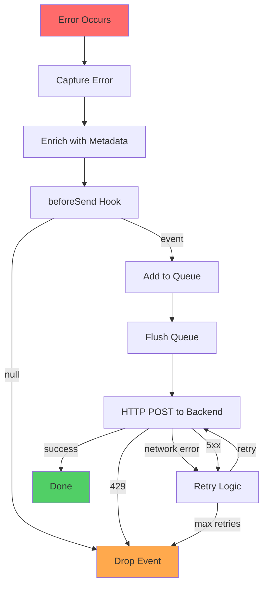

# Runtime SDK Design

## Overview

The Runtime SDK is an NPM package installed in the user's production application. It captures errors and sends structured telemetry to the backend.

**Critical Constraint:** The SDK MUST NEVER crash the host application.

---

## Installation

```bash
npm install @rootly/runtime
```

---

## Initialization

### Basic Usage

```typescript
import { init } from '@rootly/runtime';

init({
  projectId: 'proj_abc123',
  apiKey: process.env.ROOTLY_API_KEY,
});
```

### Configuration Options

```typescript
interface RootlyConfig {
  // Required
  projectId: string;
  apiKey: string;

  // Optional
  environment?: 'production' | 'preview' | 'development';
  enabled?: boolean; // Default: true
  apiEndpoint?: string; // Default: https://api.rootly.dev
  
  // Advanced
  maxQueueSize?: number; // Default: 100
  flushInterval?: number; // Default: 5000ms
  timeout?: number; // Default: 5000ms
  
  // Callbacks
  onError?: (error: Error) => void; // Called when SDK itself errors
  beforeSend?: (event: ErrorEvent) => ErrorEvent | null; // Filter/modify events
}
```

---

## Error Capture

### Automatic Capture

The SDK automatically captures:
- Unhandled exceptions
- Unhandled promise rejections

```typescript
// Automatically captured
throw new Error('Something went wrong');

// Automatically captured
Promise.reject(new Error('Async error'));
```

### Manual Capture

```typescript
import { captureError } from '@rootly/runtime';

try {
  riskyOperation();
} catch (error) {
  captureError(error, {
    tags: { component: 'checkout' },
    extra: { userId: '12345' },
  });
}
```

---

## Metadata Extraction

### Deployment Context

The SDK automatically extracts metadata from environment variables:

#### Vercel
```typescript
{
  commit_sha: process.env.VERCEL_GIT_COMMIT_SHA,
  deployment_id: process.env.VERCEL_DEPLOYMENT_ID,
  environment: process.env.VERCEL_ENV, // 'production' | 'preview'
  branch: process.env.VERCEL_GIT_COMMIT_REF,
}
```

#### AWS Lambda (Future)
```typescript
{
  commit_sha: process.env.AWS_LAMBDA_FUNCTION_VERSION,
  deployment_id: process.env.AWS_REQUEST_ID,
  environment: process.env.STAGE,
}
```

#### Cloudflare Workers (Future)
```typescript
{
  commit_sha: process.env.CF_PAGES_COMMIT_SHA,
  deployment_id: process.env.CF_PAGES_DEPLOYMENT_ID,
  environment: process.env.CF_PAGES_BRANCH === 'main' ? 'production' : 'preview',
}
```

### Stack Trace Parsing

```typescript
// Input: Error object
const error = new Error('Cannot read property "id" of undefined');

// SDK extracts:
{
  message: 'Cannot read property "id" of undefined',
  type: 'TypeError',
  stack: 'TypeError: Cannot read property...\n  at checkout.ts:42:10\n  at ...',
}

// Parsed stack frames:
[
  {
    file: 'src/handlers/checkout.ts',
    line: 42,
    column: 10,
    function: 'processCheckout',
  },
  // ... more frames
]
```

---

## Internal Flow

### Event Lifecycle



### Queueing Strategy

**Why Queue?**
- Batch multiple errors into single HTTP request
- Reduce network overhead
- Handle temporary network failures

**Queue Behavior:**
```typescript
class EventQueue {
  private queue: ErrorEvent[] = [];
  private maxSize: number = 100;
  private flushInterval: number = 5000; // 5 seconds

  add(event: ErrorEvent): void {
    if (this.queue.length >= this.maxSize) {
      // Drop oldest event (FIFO)
      this.queue.shift();
    }
    this.queue.push(event);
  }

  flush(): void {
    if (this.queue.length === 0) return;

    const batch = this.queue.splice(0, this.queue.length);
    this.sendBatch(batch);
  }
}
```

**Flush Triggers:**
- Timer: Every 5 seconds
- Size: Queue reaches 10 events
- Process exit: Before application shutdown

---

## Network Layer

### HTTP Client

```typescript
async function sendTelemetry(event: ErrorEvent): Promise<void> {
  const response = await fetch('https://api.rootly.dev/api/ingest', {
    method: 'POST',
    headers: {
      'Authorization': `Bearer ${config.apiKey}`,
      'Content-Type': 'application/json',
    },
    body: JSON.stringify(event),
    signal: AbortSignal.timeout(config.timeout),
  });

  if (!response.ok) {
    throw new Error(`HTTP ${response.status}`);
  }
}
```

### Retry Logic

```typescript
async function sendWithRetry(event: ErrorEvent): Promise<void> {
  const maxRetries = 3;
  const baseDelay = 1000; // 1 second

  for (let attempt = 0; attempt < maxRetries; attempt++) {
    try {
      await sendTelemetry(event);
      return; // Success
    } catch (error) {
      if (error.status === 429) {
        // Rate limited - drop event
        return;
      }

      if (error.status >= 400 && error.status < 500) {
        // Client error - don't retry
        return;
      }

      // Network error or 5xx - retry with exponential backoff
      const delay = baseDelay * Math.pow(2, attempt);
      await sleep(delay);
    }
  }

  // Max retries exceeded - drop event
}
```

---

## Error Handling (SDK Internal)

**Principle:** SDK errors MUST NOT crash the host application.

```typescript
function safeInit(config: RootlyConfig): void {
  try {
    validateConfig(config);
    setupErrorHandlers();
    startFlushTimer();
  } catch (error) {
    // Log to console (development only)
    if (process.env.NODE_ENV === 'development') {
      console.error('[Rootly SDK] Initialization failed:', error);
    }

    // Call user-provided error handler
    config.onError?.(error);

    // Disable SDK
    globalState.enabled = false;
  }
}

function safeCaptureError(error: Error): void {
  try {
    const event = buildErrorEvent(error);
    queue.add(event);
  } catch (sdkError) {
    // SDK error - fail silently
    if (process.env.NODE_ENV === 'development') {
      console.error('[Rootly SDK] Capture failed:', sdkError);
    }
  }
}
```

---

## Configuration Validation

```typescript
function validateConfig(config: RootlyConfig): void {
  // Required fields
  if (!config.projectId) {
    throw new Error('projectId is required');
  }

  if (!config.apiKey) {
    throw new Error('apiKey is required');
  }

  // Format validation
  if (!/^proj_[a-zA-Z0-9]+$/.test(config.projectId)) {
    throw new Error('Invalid projectId format');
  }

  if (!/^key_[a-zA-Z0-9]+$/.test(config.apiKey)) {
    throw new Error('Invalid apiKey format');
  }

  // Environment validation
  const validEnvs = ['production', 'preview', 'development'];
  if (config.environment && !validEnvs.includes(config.environment)) {
    throw new Error(`Invalid environment. Must be one of: ${validEnvs.join(', ')}`);
  }
}
```

---

## Event Payload

### Structure

```typescript
interface ErrorEvent {
  // Error details
  error: {
    message: string;
    type: string; // e.g., 'TypeError', 'ReferenceError'
    stack: string;
  };

  // Deployment context
  context: {
    commit_sha: string;
    deployment_id?: string;
    environment: 'production' | 'preview' | 'development';
    occurred_at: string; // ISO 8601 timestamp
  };

  // Platform metadata
  metadata: {
    platform: string; // 'vercel', 'aws-lambda', etc.
    runtime: string; // 'nodejs20.x'
    region?: string;
    [key: string]: any; // Extensible
  };

  // User-provided context (optional)
  tags?: Record<string, string>;
  extra?: Record<string, any>;
}
```

### Example Payload

```json
{
  "error": {
    "message": "Cannot read property 'id' of undefined",
    "type": "TypeError",
    "stack": "TypeError: Cannot read property 'id' of undefined\n  at processCheckout (src/handlers/checkout.ts:42:10)\n  at handler (src/api/checkout.ts:15:5)"
  },
  "context": {
    "commit_sha": "a1b2c3d4e5f6789012345678901234567890abcd",
    "deployment_id": "dpl_vercel_abc123",
    "environment": "production",
    "occurred_at": "2026-02-06T02:30:00.000Z"
  },
  "metadata": {
    "platform": "vercel",
    "runtime": "nodejs20.x",
    "region": "us-east-1"
  },
  "tags": {
    "component": "checkout",
    "version": "1.2.3"
  },
  "extra": {
    "userId": "usr_12345",
    "cartTotal": 99.99
  }
}
```

---

## Performance Considerations

### Bundle Size
- **Target:** <10KB gzipped
- **Strategy:** Zero dependencies, tree-shakeable exports

### Runtime Overhead
- **Capture:** <1ms per error
- **Queue flush:** <5ms per batch
- **Memory:** <1MB for queue (100 events)

### Network Impact
- **Batching:** Reduce HTTP requests
- **Compression:** gzip request bodies
- **Async:** Never block main thread

---

## Security

### API Key Protection

```typescript
// NEVER log API key
function sanitizeConfig(config: RootlyConfig): any {
  return {
    ...config,
    apiKey: '***REDACTED***',
  };
}

// NEVER include API key in error messages
function buildErrorMessage(error: Error): string {
  return error.message.replace(/key_[a-zA-Z0-9]+/g, '***REDACTED***');
}
```

### PII Sanitization

```typescript
// beforeSend hook example
init({
  projectId: 'proj_abc123',
  apiKey: process.env.ROOTLY_API_KEY,
  beforeSend: (event) => {
    // Remove sensitive data
    if (event.extra?.password) {
      delete event.extra.password;
    }

    // Sanitize error message
    event.error.message = event.error.message.replace(
      /\b[\w\.-]+@[\w\.-]+\.\w{2,4}\b/g,
      '***EMAIL***'
    );

    return event;
  },
});
```

---

## Testing

### Unit Tests

```typescript
describe('SDK', () => {
  it('should capture errors', () => {
    const error = new Error('Test error');
    captureError(error);
    
    expect(queue.length).toBe(1);
    expect(queue[0].error.message).toBe('Test error');
  });

  it('should fail silently on invalid config', () => {
    expect(() => {
      init({ projectId: '', apiKey: '' });
    }).not.toThrow();
  });

  it('should sanitize PII in beforeSend', () => {
    init({
      projectId: 'proj_test',
      apiKey: 'key_test',
      beforeSend: (event) => {
        event.error.message = event.error.message.replace(/secret/g, '***');
        return event;
      },
    });

    captureError(new Error('secret data'));
    expect(queue[0].error.message).toBe('*** data');
  });
});
```

### Integration Tests

```typescript
describe('SDK Integration', () => {
  it('should send telemetry to backend', async () => {
    const mockBackend = setupMockServer();
    
    init({
      projectId: 'proj_test',
      apiKey: 'key_test',
      apiEndpoint: mockBackend.url,
    });

    captureError(new Error('Test error'));
    await flushQueue();

    expect(mockBackend.requests).toHaveLength(1);
    expect(mockBackend.requests[0].body.error.message).toBe('Test error');
  });
});
```

---

## Deployment

### NPM Package

```json
{
  "name": "@rootly/runtime",
  "version": "1.0.0",
  "main": "dist/index.js",
  "types": "dist/index.d.ts",
  "files": ["dist"],
  "scripts": {
    "build": "tsc",
    "test": "jest",
    "prepublishOnly": "npm run build && npm test"
  }
}
```

### Versioning

- **Major:** Breaking API changes
- **Minor:** New features (backward compatible)
- **Patch:** Bug fixes

### Changelog

```markdown
## 1.0.0 (2026-02-06)
- Initial release
- Error capture
- Vercel platform support
```

---

## Future Enhancements

### Source Maps
- Upload source maps to backend
- Map minified stack traces to original source

### Breadcrumbs
- Track user actions before error
- HTTP requests, console logs, navigation

### Performance Monitoring
- Capture slow function calls
- Database query timing
- API response times

### Custom Context
- User identification
- Session replay
- Custom tags/metadata
